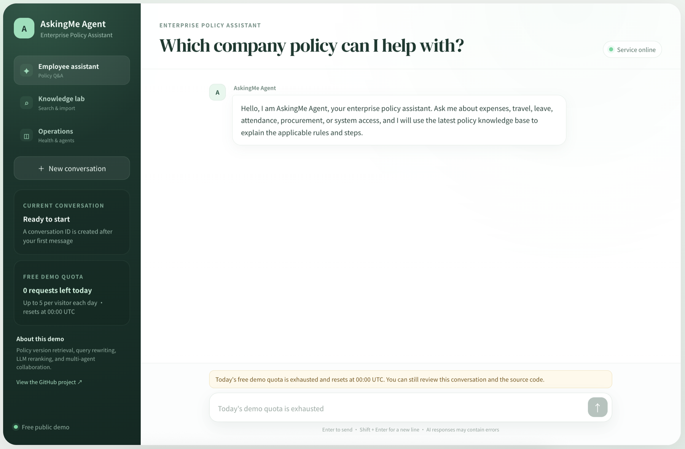
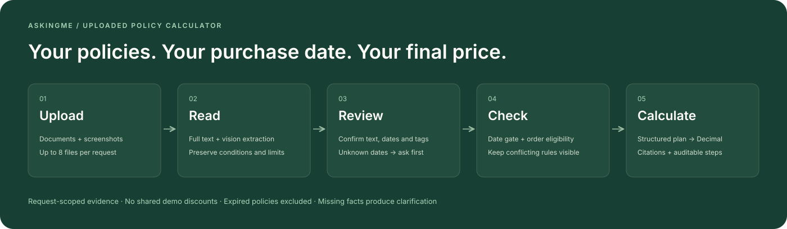

<div align="center">

# AskingMe AI Agent

### Final price intelligence — from discount rules to the amount you pay

[](https://www.python.org/)
[](https://fastapi.tiangolo.com/)
[](https://react.dev/)
[](https://www.langchain.com/langgraph)
[](https://www.elastic.co/elasticsearch)
[](rag/calculator.py)

**[Try the live demo ↗](http://52.13.228.228)** &nbsp; · &nbsp; **[Architecture](#architecture)** &nbsp; · &nbsp; **[Quick start](#quick-start)** &nbsp; · &nbsp; **[Technical guide](docs/technical-guide.md)**

AskingMe turns complex promotion rules into a clear, traceable final price.<br>
Upload policy files or screenshots. Check dates and conditions. Compute the amount.

</div>

<p align="center">
  <a href="http://52.13.228.228">
    
  </a>
</p>

## Upload your policies → calculate your price

The full application opens with **Final Price Agent** chat. Select **Policy Calculator** for your own documents. Upload offer documents or screenshots, review the extracted text, effective dates and labels, then enter the purchase date and order facts. The agent uses **only those uploaded policies** to check eligibility and calculate a cited final price.

<p align="center"></p>

| You provide | The agent does |
|---|---|
| Policy documents or screenshots | Reads text or uses vision to preserve amounts, conditions and exclusions |
| Reviewed policy dates and labels | Excludes expired/not-yet-effective policies; checks written conditions against order facts |
| Original subtotal, purchase date, category and eligibility facts | Computes supported prices with Decimal, or asks for missing information |
| Several overlapping policies | Keeps active evidence together and flags conflicts instead of assuming stacking |

**[Setup and upload workflow →](docs/policy-calculator.md)** · Requires the full backend and a vision-capable model. The upload workflow requires the updated backend; the original hosted deployment has not yet been upgraded.

<details><summary><strong>See the policy upload workspace</strong></summary>
<br>

</details>

## Live demo

**[Open the full AskingMe Agent ↗](http://52.13.228.228)** · **[Browse 500 evaluation cases](https://irenezhangtt.github.io/AskingMe-Agent/golden.html)**

The project demo is the original React conversation application, backed by a live API. The hosted server currently runs the earlier enterprise-policy version; deployment of the final-price backend is pending. Use [Quick start](#quick-start) to run the current final-price application.

In the current source, natural-language questions pass through Elasticsearch hybrid retrieval and evidence selection. When no usable context is selected, the LLM reformulates the request with bounded retries. It then interprets policy conditions, proposes a cited plan, and calls Decimal arithmetic. Rewriting is conditional, not performed on every request.

The **Policy Calculator** tab accepts uploaded documents and screenshots, reviewed validity dates and labels, and order facts. It supplies all active uploaded evidence to the model so a retrieval cutoff cannot silently drop an exception. Both paths require a configured backend and model access.

<details><summary><strong>View the conversation workspace</strong></summary>
<br>

</details>

## Why this project

“What will I actually pay?” becomes difficult when a promotion combines threshold discounts, category restrictions, coupon eligibility, membership benefits, and rounding rules. A correct answer needs both the applicable policy and the right order of operations.

AskingMe connects **evidence retrieval**, **rule interpretation**, and **executable arithmetic**. The agent produces a structured calculation plan with source references; the Decimal tool evaluates supported expressions and returns the amount with intermediate steps. Missing inputs or unsupported rules should produce clarification.

## Engineering highlights

| Capability | Implementation | Purpose |
|---|---|---|
| **Uploaded policy calculation** | File/vision extraction → review → date gate → plan → Decimal | Calculate from request-scoped evidence and explicit order facts |
| **Stateful reasoning** | LangGraph analysis → retrieval → reranking → answer plan | Reformulate weak queries with bounded retries |
| **Hybrid retrieval** | Elasticsearch BM25 + BGE vectors, combined with RRF | Match semantic questions and exact amounts or terms |
| **Rule integrity** | Hierarchical Markdown chunking, bracket checks, metadata | Preserve nested conditions and complete formulas |
| **Precise calculation** | Bounded Decimal expression tool and final half-up rounding | Execute arithmetic and expose intermediate results |
| **Evidence selection** | Cross-Encoder reranking and dynamic Top-K | Keep relevant context within a token budget |
| **Document governance** | Drafts, approval, replacement, archival, deletion | Retrieve only approved rule versions |
| **Evaluation** | Retrieval ablations and assertion-level judging | Measure recall, faithfulness, coverage, and latency |

## Architecture

<p align="center">
  <a href="docs/images/final-price-architecture.svg">
    
  </a>
</p>

The diagram above describes the shared-knowledge chat path. The upload workflow uses all reviewed policies in the current request, with an explicit date gate, before the same bounded Decimal execution. The AI interprets the evidence and proposes a plan. The calculation tool validates supported arithmetic and computes the final price. Model-dependent eligibility and rule selection still require evaluation; deterministic arithmetic alone does not establish end-to-end accuracy.

### A calculation you can follow

<p align="center">
  <a href="docs/images/final-price-workflow.svg">
    
  </a>
</p>

The included fictional rules apply the threshold discount once, then one eligible coupon, then the member discount. Intermediate results are not rounded to cents; the final price uses half-up rounding.

## Quick start

For the full agent, install Docker with Compose and provide an Anthropic-compatible API key.

```bash
git clone https://github.com/Irenezhangtt/AskingMe-Agent.git
cd AskingMe-Agent
cp .env.example .env
# Set ANTHROPIC_API_KEY, REDIS_PASSWORD, and ADMIN_API_KEY.
docker compose up -d --build
```

Open **[the local application](http://localhost)** or **[API documentation](http://localhost/docs)**. The first launch downloads the embedding and reranking models. An empty Elasticsearch index is seeded with the three English example rule documents.

For your own policies, open **Policy Calculator**, unlock with `ADMIN_API_KEY`, and follow the [upload guide](docs/policy-calculator.md). Screenshot extraction requires a vision-capable `ANSWER_MODEL`.

For the shared-knowledge chat, try asking:

> During the Demo Promotion, what is the final price of a CNY 400 appliance if I have a valid, claimed CNY 20 coupon and a membership?

For configuration, API examples, deployment notes, and model/index migration, see the **[technical guide](docs/technical-guide.md)**.

## Evaluation and verification

The versioned [500-case golden set](examples/evaluation/golden/) covers 25 condition families, including nested parentheses, exclusions, AND/OR groups, thresholds, dates and rounding. Expected prices use an independent rational/integer-cent oracle. These are synthetic examples inspected during development, not independently human-labeled production data.

| Measured run | Result |
|---|---|
| Complete first agent run | 492/500 passed; 382/390 exact numerical prices |
| Real ES hybrid retrieval | Recall@5 **96.25%** across 480 retrievable cases |
| Current rerank + context selection | Recall@5 **63.96%**; a measured coverage regression |
| New condition-explanation format | Incomplete: 338 provider errors after API credit exhaustion |

**[Full results, failures and limitations](docs/golden-evaluation.md)** · **[Resume implementation audit](docs/resume-implementation-audit.md)**. The complete first-run score does not certify the newer answer format. The retrieval experiment triggered zero rewrites, so it does not establish rewrite effectiveness.


| Check | Verified status |
|---|---|
| Backend regression suite | **77 passed**, plus the optional ES test skipped in the offline run |
| Real Elasticsearch 8.17.2 integration | **Passed separately** — writes, BM25/kNN, filters, approval, archival, deletion |
| Live screenshot-to-price smoke test | **Passed** — synthetic screenshot, validity extraction, CNY 297.00 and expired-policy exclusion |
| Interactive demo calculation tests | **4 passed** — boundaries, eligibility, half-up rounding, invalid inputs |
| Demo browser checks | Desktop scenarios and mobile overflow checks passed |
| React frontend | Lint and production build passed |

The offline benchmark compares **dense retrieval**, **hybrid search**, **hybrid + reranking**, and the **full rewriting pipeline**. It reports Recall@5, MRR@5, faithfulness, reference-claim coverage, stage traces, and latency.

The original eight labeled examples remain small smoke-test fixtures; the 500-case synthetic suite is reported separately above. Production accuracy, recall improvements, and scale claims require a model-backed benchmark on a representative dataset.

<details>
<summary><strong>Run the checks and benchmark</strong></summary>

```bash
.venv/bin/python -m unittest discover -s tests -v
.venv/bin/python scripts/test_es_integration.py
node --test tests/test_demo_calculator.mjs
npm --prefix frontend run lint
npm --prefix frontend run build

# Uses the configured Elasticsearch/model services.
.venv/bin/python -m evaluation.rag_benchmark \
  --dataset examples/evaluation/pricing.jsonl \
  --output reports/pricing.json
# Add --generate for answer generation and assertion judging (uses API credits).
```

See the [Elasticsearch verification record](docs/elasticsearch-verification.md) and [evaluation details](docs/technical-guide.md#offline-evaluation).

</details>

## Explore the code

```text
rag/           LangGraph, hybrid search, reranking, prompts, Decimal calculator
api/           FastAPI chat, streaming, knowledge administration
frontend/      React agent, knowledge lab, operations workspace
examples/      Fictional English promotion rules and labeled evaluation queries
evaluation/    Retrieval ablations and assertion-level evaluation
scripts/       Reproducible real-Elasticsearch test runner
tests/         Calculator, API, graph, retrieval, and lifecycle tests
docs/          Public interactive demo, diagrams, and implementation guides
```

**[Implementation map](docs/pricing-migration.md)** · **[Full technical guide](docs/technical-guide.md)** · **[ES verification](docs/elasticsearch-verification.md)** · **[Legacy enterprise architecture](docs/legacy-enterprise.md)**

<p align="center">
  <br>
  <strong>AskingMe · Final Price AI Agent</strong><br>
  <sub>Evidence for the rules. A calculation for the amount.</sub>
</p>
