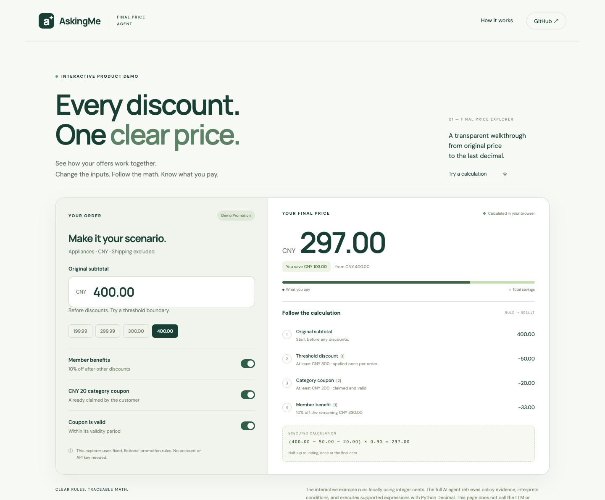
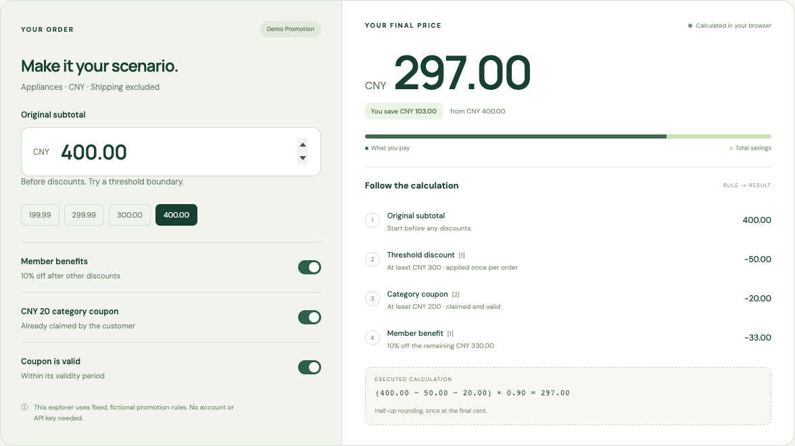
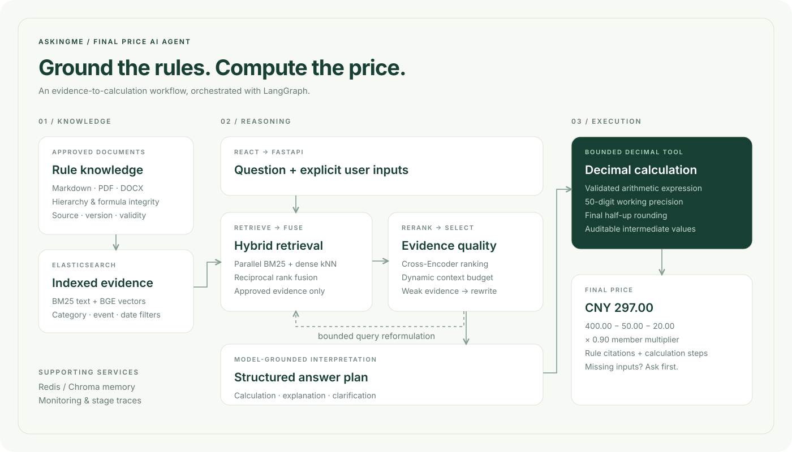
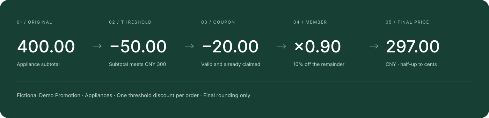

<div align="center">

# AskingMe AI Agent

### Final price intelligence — from discount rules to the amount you pay

[](https://www.python.org/)
[](https://fastapi.tiangolo.com/)
[](https://react.dev/)
[](https://www.langchain.com/langgraph)
[](https://www.elastic.co/elasticsearch)
[](rag/calculator.py)

**[Try the live demo ↗](https://irenezhangtt.github.io/AskingMe-Agent/)** &nbsp; · &nbsp; **[Architecture](#architecture)** &nbsp; · &nbsp; **[Quick start](#quick-start)** &nbsp; · &nbsp; **[Technical guide](docs/technical-guide.md)**

AskingMe turns complex promotion rules into a clear, traceable final price.<br>
Retrieve the evidence. Check the conditions. Compute the amount.

</div>

<p align="center">
  <a href="https://irenezhangtt.github.io/AskingMe-Agent/">
    
  </a>
</p>

<p align="center">
  <strong>400.00 − 50.00 − 20.00 → 10% member discount → CNY 297.00</strong><br>
  <sub>Open the interactive demo to change the inputs and follow the calculation.</sub>
</p>

## Live demo

Explore a fictional **Demo Promotion** for appliances. Change the original subtotal, toggle membership and coupon eligibility, and see the final price, savings, applicable rules, and arithmetic update immediately.

**[Launch the Final Price Explorer ↗](https://irenezhangtt.github.io/AskingMe-Agent/)**

| Try this | What to inspect |
|---|---|
| **CNY 400.00**, member, valid claimed coupon | The complete calculation produces **CNY 297.00** |
| Change **299.99 → 300.00** | The threshold discount becomes eligible at exactly CNY 300 |
| Turn off membership | The extra 10% discount no longer applies |
| Disable coupon validity or claim status | The CNY 20 coupon is excluded |

The public explorer runs the fixed example rules locally with integer-cent arithmetic. It needs no API key and does not call an LLM or Elasticsearch. The **full AI agent**, described below, retrieves rules and uses a Python Decimal tool; [run it locally](#quick-start) to ask natural-language questions.

<details>
<summary><strong>Watch the calculation change</strong></summary>
<br>
<p align="center">
  <a href="https://irenezhangtt.github.io/AskingMe-Agent/">
    
  </a>
</p>
</details>

## Why this project

“What will I actually pay?” becomes difficult when a promotion combines threshold discounts, category restrictions, coupon eligibility, membership benefits, and rounding rules. A correct answer needs both the applicable policy and the right order of operations.

AskingMe connects **evidence retrieval**, **rule interpretation**, and **executable arithmetic**. The agent produces a structured calculation plan with source references; the Decimal tool evaluates supported expressions and returns the amount with intermediate steps. Missing inputs or unsupported rules should produce clarification.

## Engineering highlights

| Capability | Implementation | Purpose |
|---|---|---|
| **Stateful reasoning** | LangGraph analysis → retrieval → reranking → answer plan | Reformulate weak queries with bounded retries |
| **Hybrid retrieval** | Elasticsearch BM25 + BGE vectors, combined with RRF | Match semantic questions and exact amounts or terms |
| **Rule integrity** | Hierarchical Markdown chunking, bracket checks, metadata | Preserve nested conditions and complete formulas |
| **Precise calculation** | Bounded Decimal expression tool and final half-up rounding | Execute arithmetic and expose intermediate results |
| **Evidence selection** | Cross-Encoder reranking and dynamic Top-K | Keep relevant context within a token budget |
| **Document governance** | Drafts, approval, replacement, archival, deletion | Retrieve only approved rule versions |
| **Evaluation** | Retrieval ablations and assertion-level judging | Measure recall, faithfulness, coverage, and latency |

## Architecture

<p align="center">
  <a href="docs/images/final-price-architecture.svg">
    
  </a>
</p>

The AI interprets retrieved rules and proposes a plan. The calculation tool validates supported arithmetic and computes the final price. Model-dependent eligibility and rule selection still require evaluation; deterministic arithmetic alone does not establish end-to-end accuracy.

### A calculation you can follow

<p align="center">
  <a href="docs/images/final-price-workflow.svg">
    
  </a>
</p>

The included fictional rules apply the threshold discount once, then one eligible coupon, then the member discount. Intermediate results are not rounded to cents; the final price uses half-up rounding.

## Quick start

For the full agent, install Docker with Compose and provide an Anthropic-compatible API key.

```bash
git clone https://github.com/Irenezhangtt/AskingMe-Agent.git
cd AskingMe-Agent
cp .env.example .env
# Set ANTHROPIC_API_KEY, REDIS_PASSWORD, and ADMIN_API_KEY.
docker compose up -d --build
```

Open **[the local application](http://localhost)** or **[API documentation](http://localhost/docs)**. The first launch downloads the embedding and reranking models. An empty Elasticsearch index is seeded with the three English example rule documents.

Try asking:

> During the Demo Promotion, what is the final price of a CNY 400 appliance if I have a valid, claimed CNY 20 coupon and a membership?

For configuration, API examples, deployment notes, and model/index migration, see the **[technical guide](docs/technical-guide.md)**.

## Evaluation and verification

| Check | Verified status |
|---|---|
| Backend regression suite | **47 passed**, plus the optional ES test skipped in the offline run |
| Real Elasticsearch 8.17.2 integration | **Passed separately** — writes, BM25/kNN, filters, approval, archival, deletion |
| Interactive demo calculation tests | **4 passed** — boundaries, eligibility, half-up rounding, invalid inputs |
| Demo browser checks | Desktop scenarios and mobile overflow checks passed |
| React frontend | Lint and production build passed |

The offline benchmark compares **dense retrieval**, **hybrid search**, **hybrid + reranking**, and the **full rewriting pipeline**. It reports Recall@5, MRR@5, faithfulness, reference-claim coverage, stage traces, and latency.

The eight labeled examples are demonstration fixtures. Production accuracy, recall improvements, and scale claims require a model-backed benchmark on a representative dataset.

<details>
<summary><strong>Run the checks and benchmark</strong></summary>

```bash
.venv/bin/python -m unittest discover -s tests -v
.venv/bin/python scripts/test_es_integration.py
node --test tests/test_demo_calculator.mjs
npm --prefix frontend run lint
npm --prefix frontend run build

# Uses the configured Elasticsearch/model services.
.venv/bin/python -m evaluation.rag_benchmark \
  --dataset examples/evaluation/pricing.jsonl \
  --output reports/pricing.json
# Add --generate for answer generation and assertion judging (uses API credits).
```

See the [Elasticsearch verification record](docs/elasticsearch-verification.md) and [evaluation details](docs/technical-guide.md#offline-evaluation).

</details>

## Explore the code

```text
rag/           LangGraph, hybrid search, reranking, prompts, Decimal calculator
api/           FastAPI chat, streaming, knowledge administration
frontend/      React agent, knowledge lab, operations workspace
examples/      Fictional English promotion rules and labeled evaluation queries
evaluation/    Retrieval ablations and assertion-level evaluation
scripts/       Reproducible real-Elasticsearch test runner
tests/         Calculator, API, graph, retrieval, and lifecycle tests
docs/          Public interactive demo, diagrams, and implementation guides
```

**[Implementation map](docs/pricing-migration.md)** · **[Full technical guide](docs/technical-guide.md)** · **[ES verification](docs/elasticsearch-verification.md)** · **[Legacy enterprise architecture](docs/legacy-enterprise.md)**

<p align="center">
  <br>
  <strong>AskingMe · Final Price AI Agent</strong><br>
  <sub>Evidence for the rules. A calculation for the amount.</sub>
</p>
