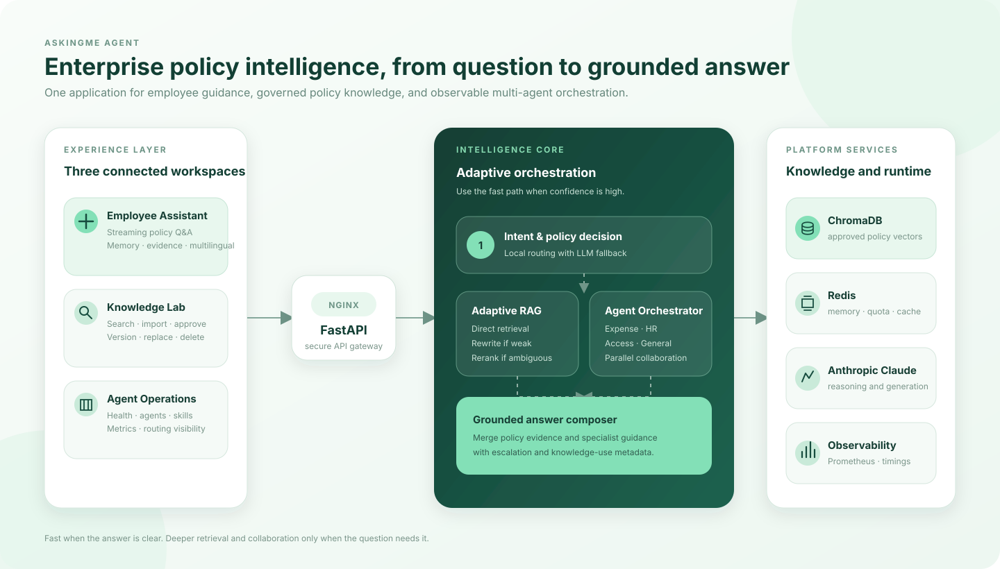
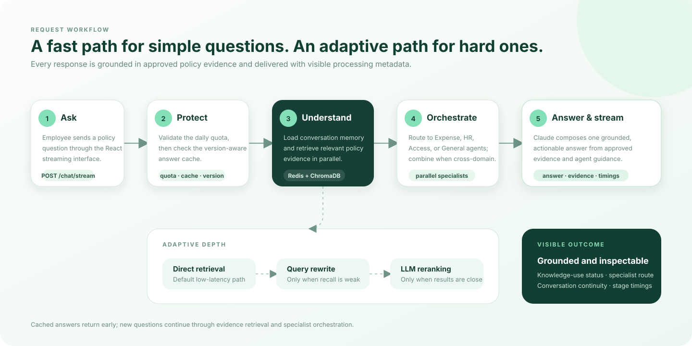
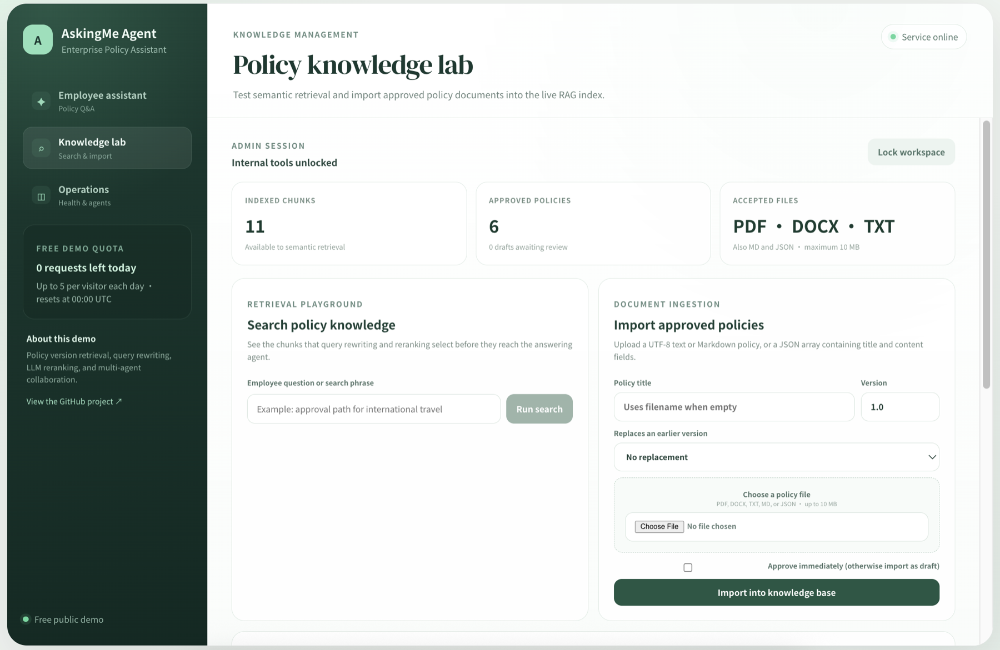
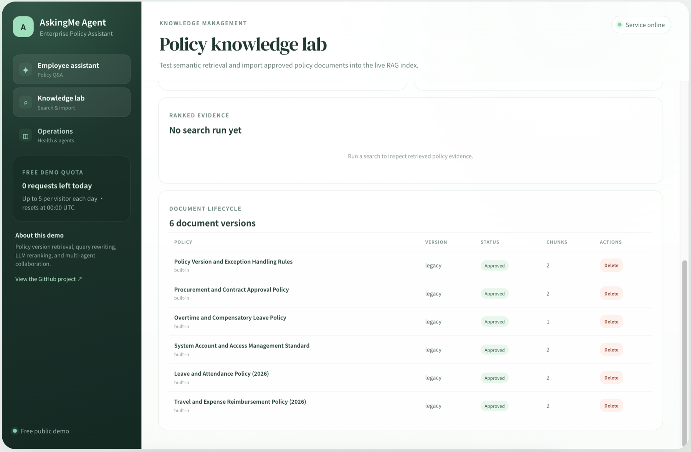
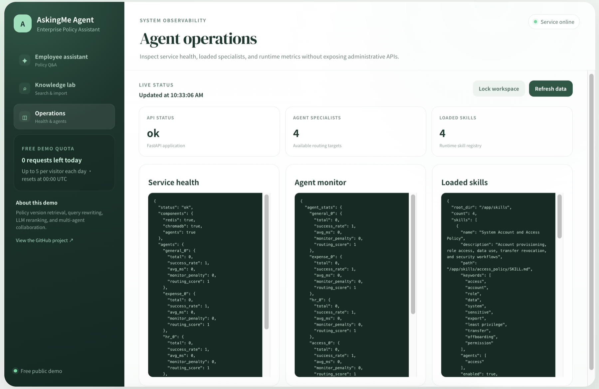

<div align="center">

# AskingMe AI Agent :)

### Enterprise policy intelligence powered by LLMs, adaptive RAG, and multi-agent orchestration

[](https://www.python.org/)
[](https://fastapi.tiangolo.com/)
[](https://react.dev/)
[](https://www.anthropic.com/)
[](https://www.trychroma.com/)
[](https://www.docker.com/)

**[Live demo](http://52.13.228.228)** · **[API docs](http://52.13.228.228/docs)** · **[Architecture](#-system-architecture)** · **[Evaluation](#-evaluation-framework)**

AskingMe Agent turns fragmented, frequently changing enterprise policies into grounded, actionable answers for internal employees.

</div>


## Why this project

Enterprise policy search is not a simple chatbot problem:

- policies are distributed across teams and document formats;
- multiple versions may conflict or supersede one another;
- employees describe the same workflow using different language;
- one question can span HR, expenses, procurement, and system access;
- sensitive or exceptional requests require human review rather than confident automation.

AskingMe addresses these constraints with a version-aware RAG pipeline, specialist-agent routing, multi-turn memory, document governance, and an explicit administrative boundary.

## Engineering highlights

| Capability | Implementation | Why it matters |
|---|---|---|
|  **Adaptive RAG** | Direct vector retrieval first; query rewriting and LLM reranking only when confidence is weak | Preserves retrieval quality without paying the full latency cost on every request |
|  **Multi-agent routing** | Expense, HR, Access, and General specialists with parallel execution for cross-domain questions | Keeps prompts domain-focused and supports compound employee requests |
|  **Policy lifecycle** | PDF/DOCX/TXT/MD/JSON ingestion, duplicate detection, draft approval, version replacement, archival, and deletion | Prevents outdated policy versions from silently grounding answers |
|  **Latency-aware execution** | Local intent fast path, parallel context loading, answer caching, model separation, and streamed responses | Reduces common-path model calls and improves perceived responsiveness |
|  **Conversation memory** | Redis-backed multi-turn context with browser-persisted conversation IDs | Supports follow-up and recall questions without resending full history |
|  **Safe escalation** | Human-review recommendations for missing provisions, conflicts, exceptions, and sensitive access | Avoids presenting generated guidance as an administrative decision |
|  **Observability** | Prometheus metrics, agent statistics, health checks, tool status, and stage-level latency timings | Makes routing and RAG behavior measurable rather than opaque |
|  **Multilingual interaction** | The response follows the language used in the employee's question | Supports English and Chinese users without separate interfaces |

## System architecture

<p align="center">
  <a href="docs/images/askingme-architecture.svg">
    
  </a>
</p>

The application separates the public employee surface from protected knowledge and operations tools:

```text
Employee / Policy Administrator
            │
        React UI
            │
      Nginx gateway
            │
       FastAPI API
       ├── Redis            conversation memory · quota · answer cache
       ├── ChromaDB         approved policy chunks · vector retrieval
       ├── Orchestrator     specialist routing · parallel collaboration
       ├── Anthropic        grounded answer generation · optional reranking
       └── Prometheus       service and pipeline metrics
```

### Request lifecycle

<p align="center">
  <a href="docs/images/askingme-workflow.svg">
    
  </a>
</p>

The optimized request path is:

```text
question
  → quota and version-aware cache check
  → conversation memory + policy retrieval in parallel
  → local intent classification when confidence is high
  → adaptive query rewrite and rerank only when retrieval is ambiguous
  → one specialist or multiple specialists in parallel
  → evidence-grounded response composition
  → streamed answer + metadata + cache update
```

## Adaptive RAG pipeline

### 1. Knowledge ingestion

Administrators import an approved policy through the protected Knowledge Lab:

```text
upload
  → validate file type and 10 MB limit
  → extract PDF, DOCX, TXT, Markdown, or JSON text
  → normalize content and calculate SHA-256
  → reject exact duplicates
  → split into retrieval chunks
  → generate embeddings
  → store vectors and lifecycle metadata in ChromaDB
  → approve version and archive the superseded version
  → invalidate stale answer-cache entries
```

Only approved chunks are available to employee questions. Imported vectors persist in a Docker named volume and become searchable without restarting the application.

### 2. Confidence-aware retrieval

The common path performs direct semantic retrieval. The full pipeline activates only when the top result is weak, the score margin is narrow, or the intent is ambiguous:

```text
direct retrieval
  ├── strong evidence  → preserve vector order
  └── weak evidence    → rewrite query → merge candidates → LLM rerank
```

This behavior is controlled with:

```env
RAG_REWRITE_MODE=adaptive
RAG_RERANK_MODE=adaptive
RAG_MIN_DIRECT_SCORE=0.25
RAG_MIN_DIRECT_MARGIN=0.03
RAG_RERANK_MIN_MARGIN=0.025
```

### 3. Grounded generation

The final answering agent receives the employee question, relevant conversation context, and selected policy chunks. It is instructed to:

- distinguish policy facts from recommendations;
- explain scope, prerequisites, approvers, and required documents;
- identify missing or conflicting evidence;
- avoid pretending to approve requests or change system access;
- recommend the responsible policy owner when human review is required.

## Multi-agent orchestration

| Specialist | Primary domains |
|---|---|
| `ExpenseAgent` | Travel, reimbursement, receipts, procurement, contracts |
| `HRAgent` | Leave, attendance, overtime, benefits, onboarding, offboarding |
| `AccessAgent` | Accounts, roles, permissions, sensitive data, security workflows |
| `GeneralAgent` | General policies, policy versions, scope, conversation context |

A single-domain request invokes one specialist. A compound request—such as *“How do leave approval and travel reimbursement work for the same trip?”*—can invoke multiple specialists concurrently and synthesize one response from the shared policy evidence.

## Product workspaces

| Workspace | Access | Purpose |
|---|---|---|
| **Employee Assistant** | Public demo | Streamed policy Q&A, memory, evidence indicators, and human-review recommendations |
| **Knowledge Lab** | `ADMIN_API_KEY` | Retrieval inspection, ranked evidence, ingestion, duplicates, approval, versioning, and deletion |
| **Agent Operations** | `ADMIN_API_KEY` | Health, specialists, skills, routing statistics, and runtime monitoring |

<details>
<summary><strong>Policy Knowledge Lab</strong></summary>
<br>
<p align="center">
  <a href="docs/images/knowledge-lab.png">
    
  </a>
</p>
<p align="center">
  <a href="docs/images/document-lifecycle.png">
    
  </a>
</p>
</details>

<details>
<summary><strong>Agent Operations</strong></summary>
<br>
<p align="center">
  <a href="docs/images/agent-operations.png">
    
  </a>
</p>
</details>

## Performance design

The original full pipeline could require several sequential model calls:

```text
intent classification → entity extraction → query rewrite
→ vector retrieval → LLM reranking → final answer
```

The optimized common path uses:

```text
local routing → direct retrieval → one grounded answer call
```

Implemented optimizations:

- **Zero-call routing:** high-confidence domains are classified locally.
- **Lazy entity extraction:** disabled unless a downstream workflow needs structured entities.
- **Adaptive rewrite and rerank:** expensive retrieval stages activate only when needed.
- **Parallel I/O:** Redis memory and ChromaDB retrieval load concurrently.
- **Version-aware answer cache:** repeated standalone questions can bypass another model call.
- **Knowledge warmup:** embedding and retrieval paths initialize during startup.
- **Non-blocking vector operations:** synchronous ChromaDB work runs outside the FastAPI event loop.
- **Role-specific models:** routing, retrieval, and answering can use different Claude models.
- **Bounded generation:** concise answer budgets improve latency and focus.
- **Streaming:** processing phases and answer deltas reach the UI incrementally.

Every response can expose stage timings:

```json
{
  "latency_ms": 2840.6,
  "cache_hit": false,
  "timings": {
    "memory_ms": 12.3,
    "retrieval_ms": 184.7,
    "intent_ms": 0.0,
    "answer_ms": 2610.4,
    "total_ms": 2840.6
  }
}
```

## Evaluation framework

The evaluation design compares three controlled configurations:

1. **LLM only** — no retrieval;
2. **Vector RAG** — direct semantic retrieval;
3. **Full AskingMe pipeline** — adaptive rewriting, reranking, and specialist routing.

Comparison metrics:

- grounded answer accuracy;
- retrieval Recall@5 and MRR;
- answer faithfulness;
- hallucination rate;
- intent-routing Macro-F1;
- P50/P95 end-to-end latency;
- average model calls and token usage per request.


| Metric | LLM only | Vector RAG | Full AskingMe |
|---|---:|---:|---:|
| Grounded Accuracy | 61.5% | 78.0% | 86.5% |
| Retrieval Recall@5 | N/A | 76.0% | 90.0% |
| Faithfulness | 68.2% | 87.1% | 93.4% |
| Hallucination Rate ↓ | 24.0% | 11.5% | 5.0% |
| Intent Macro-F1 | 0.81 | 0.81 | 0.88 |
| P95 Latency ↓ | 2.1 s | 3.4 s | 5.2 s |


## Technology stack

| Layer | Technologies |
|---|---|
| Frontend | React 19, Vite, React Markdown |
| API | Python 3.12, FastAPI, Uvicorn |
| LLM | Anthropic Claude |
| Retrieval | ChromaDB, semantic embeddings, adaptive query rewriting, LLM reranking |
| State | Redis conversation memory, quota enforcement, answer cache |
| Infrastructure | Docker Compose, Nginx, AWS Lightsail |
| Observability | Prometheus, health checks, agent and stage timings |

## Repository structure

```text
agents/       specialist agents, orchestration, collaboration, escalation
api/          FastAPI endpoints, streaming, cache, timings, RAG assembly
config/       Nginx and Prometheus configuration
core/         intent recognition, conversation rules, skill loading
data/         fictional policy corpus and evaluation data
evaluation/   end-to-end quality evaluation
frontend/     React employee, knowledge, and operations workspaces
mcp/          retrieval, rewriting, reranking, and circuit breakers
memory/       Redis and ChromaDB memory integrations
monitor/      performance and anomaly monitoring
skills/       domain-specific agent instructions
tests/        routing, RAG, escalation, and collaboration regression tests
```

## Quick start

### Prerequisites

- Docker with Docker Compose
- An Anthropic API key

### 1. Configure the environment

```bash
cp .env.example .env
```

At minimum:

```env
ANTHROPIC_API_KEY=your_real_key
REDIS_PASSWORD=your_long_random_password
ADMIN_API_KEY=your_64_character_random_hex_value
```

Never commit `.env`.

### 2. Start the stack

```bash
docker compose up -d --build
docker compose ps
```

Open:

- Application: [http://localhost](http://localhost)
- OpenAPI documentation: [http://localhost/docs](http://localhost/docs)

### 3. Stop the stack

```bash
docker compose down
```

Redis, ChromaDB, and Prometheus named volumes remain available for the next start.

## API examples

### Standard chat

```bash
curl -X POST http://localhost/chat \
  -H "Content-Type: application/json" \
  -d '{
    "message": "Which approvals are required for system access?",
    "user_id": "employee-demo",
    "conv_id": null
  }'
```

### Streaming chat

```http
POST /chat/stream
Content-Type: application/json
```

The streaming endpoint emits newline-delimited JSON events:

```json
{"type":"phase","phase":"context","detail":"Reading memory and retrieving policy context"}
{"type":"meta","data":{"conv_id":"...","knowledge_used":true}}
{"type":"answer","delta":"Standard access requires..."}
{"type":"done"}
```

Protected endpoints require:

```http
X-Admin-Key: <ADMIN_API_KEY>
```

The frontend stores the key in `sessionStorage` only; it is not compiled into the frontend bundle.

## Testing

Backend regression suite:

```bash
.venv/bin/python -m unittest discover -s tests -v
```

Frontend checks:

```bash
cd frontend
npm run lint
npm run build
```

## Deployment updates

After pushing to `main`, update the AWS server:

```bash
git pull origin main
docker compose up -d --build
docker compose ps
curl -fsS http://127.0.0.1/health
```

## Security boundary

- Never commit API keys, `.env`, employee data, or confidential policies.
- Use HTTPS and employee authentication before handling real internal traffic.
- Add role- and document-level authorization before connecting restricted policies.
- Restrict administrative endpoints and SSH access.
- Define retention and deletion rules for conversation memory.
- Treat answers as policy guidance and preserve links to authoritative source documents.
- Keep humans in the loop for exceptions, disputes, legal matters, and sensitive access.

## Demo scope

AskingMe Agent demonstrates enterprise RAG, confidence-aware retrieval, multi-agent routing, policy lifecycle governance, conversation memory, monitoring, and safe escalation. It is not a production HR, finance, procurement, identity, or authorization system.
