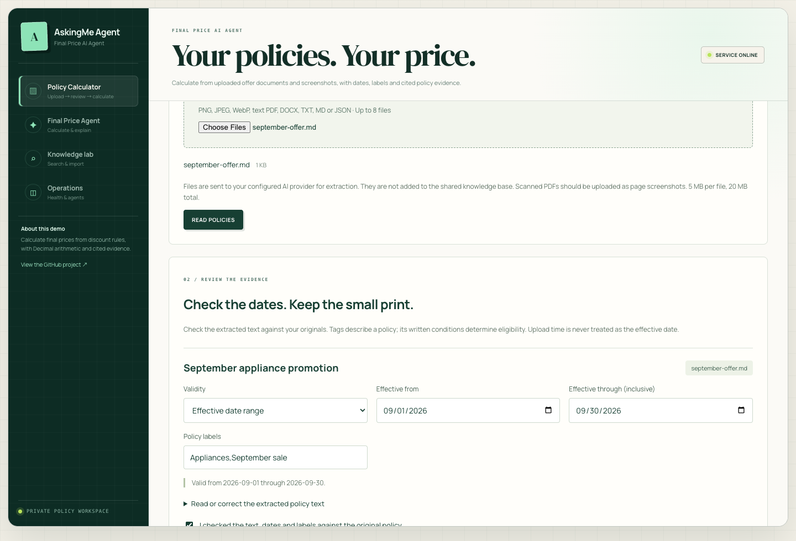

# Calculate from your own policies

The **Policy Calculator** accepts promotion documents and screenshots, extracts policy evidence, and calculates a price for a particular purchase date and set of order facts. The project interface and generated explanations are English; extracted text preserves its original language.

## Run the workflow

1. Start the full application with the [README quick start](../README.md#quick-start). Configure `ANTHROPIC_API_KEY`, a vision-capable `ANSWER_MODEL`, and `ADMIN_API_KEY`. The current application initializes its Elasticsearch RAG services at startup.
2. Open **Policy Calculator** and unlock the private workspace using your configured admin key.
3. Upload one to eight files: PNG, JPEG, WebP, text PDF, DOCX, TXT, Markdown, or a JSON array of `{title, content}` documents. Each file is limited to 5 MB; the batch to 20 MB. Extracted text is limited to 16,000 characters per file and 48,000 total. PDFs are limited to 30 pages. Submit a complete set of relevant policies, including exclusions and small print.
4. Read the extracted text, effective dates, labels, and warnings. Correct OCR mistakes against the originals, then check the review box for each policy. Edits reset the review state. The UI keeps this evidence in component memory rather than browser storage; switching views or refreshing clears it.
5. Enter the original subtotal, currency, purchase date and product category. Add product/promotion labels and known membership and coupon facts. Leave unknown facts unspecified. Use the additional-facts field for amounts, payment times, shipping/tax scope, or answers to clarification questions.
6. Calculate. The result contains cited policy evidence and Decimal calculation steps, or asks for missing information. Changing any input clears the previous result so it cannot be mistaken for the new scenario.



The screenshot illustrates a synthetic September appliance policy. Browser interaction tests use isolated API fixtures; the separate live vision smoke test sends a generated fictional screenshot to the configured model.

## What dates and labels mean

- **Validity comes from policy text**, not file creation, modification, upload time, publication time, or the device clock visible in a screenshot.
- The extractor provides a quoted date passage. Missing years, relative dates, multiple rule-specific periods and intraday restrictions require clarification. No matching date quotation means unknown validity until reviewed.
- Reviewed start/end dates are inclusive calendar dates. Explicitly one-sided validity may leave a bound empty. Confirm “No date restriction” only when that is actually true; an absent date is not an unlimited validity period.
- The server excludes policies whose reviewed date range does not include the purchase date. It returns exclusion reasons and does not call the calculation model when all policies are out of date.
- **Labels are descriptive context**, not an eligibility shortcut. The model checks actual category, product, promotion, coupon and stacking clauses against order facts. All current uploaded policies remain in context, including differently labeled policies that may contain conflicts or exclusions.
- Unknown membership/coupon facts remain `null`, not `false`. Multiple overlapping versions, unclear text, unspecified time zones or unsupported rounding should lead to a clarification, not a guessed price.

## API

Both endpoints require `X-Admin-Key`. Never embed this key in a public page or commit it to GitHub.

`POST /pricing/extract` accepts multipart `files` and returns `policies` containing full extracted text, source filename, title, date scope, effective dates, labels, date evidence, warnings and `reviewed: false`. For text files, the server retains parser output instead of a model-generated summary. Screenshots use the configured model's [vision API](https://platform.claude.com/docs/en/build-with-claude/vision).

```bash
curl http://localhost/api/pricing/extract \
  -H "X-Admin-Key: $ADMIN_API_KEY" \
  -F 'files=@september-offer.png' \
  -F 'files=@coupon-terms.pdf'
```

`POST /pricing/calculate` accepts a JSON object with the reviewed `policies` array and `order`:

```json
{
  "subtotal": "400.00",
  "currency": "CNY",
  "purchase_date": "2026-09-22",
  "category": "Appliances",
  "tags": ["September sale"],
  "member": true,
  "coupon_claimed": true,
  "coupon_valid": true,
  "details": "The valid, claimed coupon is CNY 20. Calculate merchandise subtotal excluding shipping and tax."
}
```

The JSON above is the `order` value, not the full request. Responses contain `type`, `answer`, `sources`, `excluded`, and a structured `calculation` only after a supported calculation plan has passed validation. Sources refer to the current reviewed evidence; edited text is user-supplied evidence, not an immutable or signed copy of the original upload.

## Isolation and limitations

Uploaded files are processed by the configured AI provider; provider retention depends on that service. The application does not persist uploaded files or insert their text into the shared Elasticsearch knowledge index. This calculator sends the complete bounded policy set to the planner so retrieval cannot silently omit a conflicting clause. The separate knowledge/chat workflow still uses approved Elasticsearch documents and LangGraph retrieval.

A backend deployment is required. The [GitHub Pages explorer](https://irenezhangtt.github.io/AskingMe-Agent/) remains a fixed-rule browser demo and does not process uploaded policies or hold API keys.

Vision transcription, date extraction and policy interpretation remain model-dependent. Human review is required. Decimal execution verifies arithmetic, not the semantic correctness of the proposed rule plan. Supported calculations currently require final rounding once to two decimals using half-up; other rounding, unsupported taxes/shipping, ambiguous eligibility, or incomplete evidence require clarification. This is not a checkout-price guarantee.

PDFs must contain extractable text on every page. Scans should be supplied as screenshots; mixed image/text content and document features such as embedded drawings need review against the original. DOCX body paragraphs and tables preserve their order. The API fails on oversized or invalid input rather than truncating it. Extraction has a 180-second batch timeout; calculation has a 90-second timeout. Nginx permits a 20 MB batch plus multipart overhead and waits for extraction.

## Verification

```bash
.venv/bin/python -m unittest discover -s tests -p 'test_policy_uploads.py' -v
npm --prefix frontend run lint
npm --prefix frontend run build

# Opt-in real vision/model smoke test; uses API credits and only a generated fictional image.
.venv/bin/python scripts/test_policy_vision.py
```

The live smoke test verifies a fictional September offer: vision extraction reads its validity dates and rounding rule, the planner chooses `(400 - 50 - 20) * 0.9`, Decimal returns **CNY 297.00**, and an October purchase excludes the policy. Passing one fixture does not establish production OCR or pricing accuracy.
