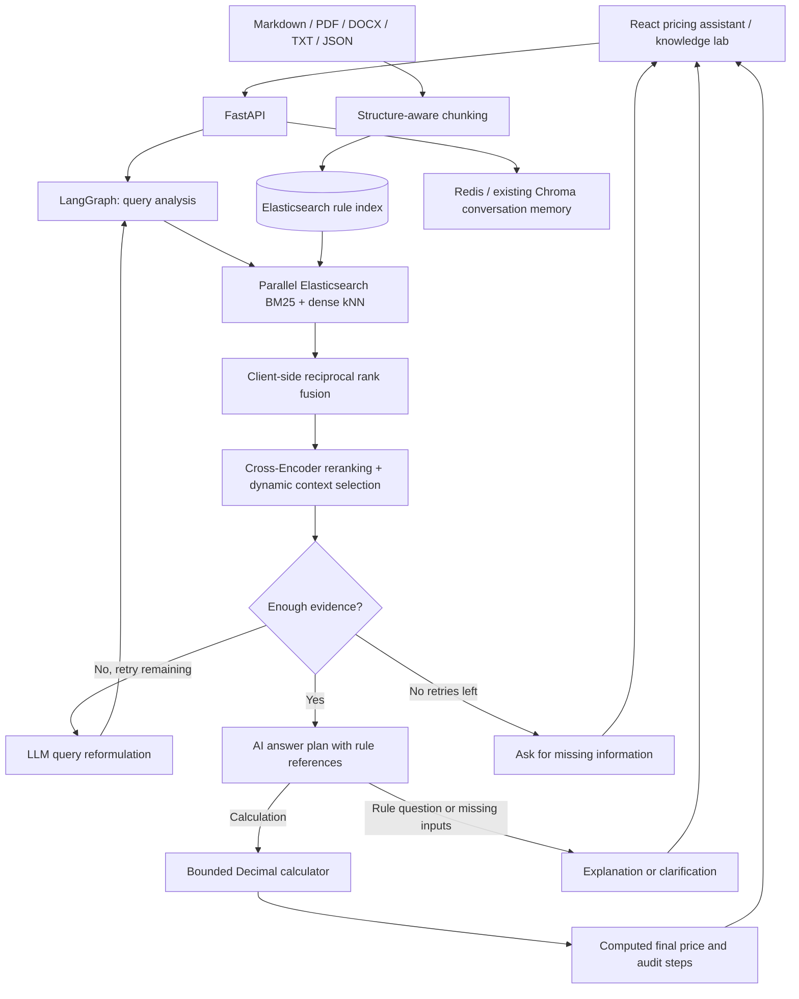

# Final Price Agent Technical Guide

**An AI agent for calculating final prices from discount rules, with evidence retrieval and deterministic Decimal arithmetic.**

AskingMe helps answer **“What is the final price I actually pay?”** It identifies applicable threshold discounts, category coupons, membership benefits, stacking order, and rounding rules from approved documents. For supported calculation requests, the AI proposes a structured expression, a bounded Decimal tool executes it, and the response shows the computed amount, intermediate steps, and numbered sources.

The goal is accurate final-price calculation: use retrieved evidence to choose rules and executable arithmetic to calculate amounts. Missing inputs, unsupported rounding, or conflicting evidence should lead to clarification. Rule selection and eligibility interpretation remain model-dependent; deterministic arithmetic alone does not guarantee end-to-end correctness.

**Stack:** Python · LangGraph · LangChain · Elasticsearch · BM25 · BGE dense retrieval · RRF · Cross-Encoder · Decimal · FastAPI · React.

This repository includes fictional English pricing rules and eight manually labeled demonstration queries. It does **not** contain a measured 65% → 83% accuracy result, a 500-query production dataset, or evidence of million-document latency/recall performance.

## Architecture



The LangGraph state is per request: original question, current query, filters, candidates, selected chunks, retry count and stage trace. Redis retains conversation context. The graph currently has no durable checkpoint/resume store.

### Final-price calculation

`rag/llm.py` asks the model for a structured calculation, explanation, or clarification plan. For a calculation, `rag/calculator.py` validates and executes the expression; the final monetary amount is formatted from the tool result rather than copied from model prose.

- Supported expressions: decimal literals, `+`, `-`, `*`, `/`, parentheses, `min`, and `max`.
- Decimal arithmetic uses 50-digit working precision; only the final monetary result is rounded to cents using `ROUND_HALF_UP`.
- Each applied operation produces an intermediate value in the calculation trace.
- Arbitrary Python execution, variables, exponentiation, division by zero, non-finite values, excessive complexity, and negative final prices are rejected.
- Calculation plans require valid references to retrieved documents and a three-letter currency code. References are checked for valid indexes; semantic support for each operand is not independently proven.
- Unsupported plans produce a clarification response. Model-selected explanation and clarification text remains generated prose; only the calculation plan path is tool-executed.

For the included fictional promotion:

| Input or rule | Value |
|---|---|
| Original appliance subtotal | CNY 400.00 |
| Threshold discount | CNY 50 off a subtotal of at least CNY 300, once per order |
| Category coupon | Valid and claimed CNY 20 coupon |
| Member benefit | 10% off after the other discounts |
| Executed expression | `(400 - 50 - 20) * 0.9` |
| Final price | **CNY 297.00** |

The tool does not infer eligibility or execute arbitrary formulas from uploaded documents. The model must resolve conditions from explicit user inputs and retrieved rules. Currency conversion, tax, shipping, unsupported rounding modes, refund allocation, and rule conflicts require additional supported rules or clarification.

### Structure-aware ingestion

`rag/chunking.py` produces LangChain `Document` objects. It recognizes Markdown heading hierarchy, recursively prefers paragraphs and sentence boundaries, and preserves balanced Chinese/English parentheses, brackets, formulas and fenced code blocks. Metadata includes parent document ID, heading path, heading level, formula type, source, version, token count and a deterministic title/heading summary.

Production chunking uses the BGE tokenizer with a default target of **400 tokens**. Complete formulas may exceed the target; they remain intact and are marked oversized. Blocks that exceed the embedding model's input limit are rejected with an actionable error instead of silently truncated. The reranker likewise rejects overlong question/document pairs. This is a structural integrity check, not a mathematical parser or a verifier of formula correctness.

Documents keep the existing draft → approved → archived lifecycle, content deduplication and deletion endpoints. Only approved chunks can be retrieved. `category`, `event`, `effective_from` and `effective_to` can be supplied at import.

### Hybrid retrieval and reranking

- Elasticsearch 8.x stores `content` with the built-in English analyzer and `embedding` as an indexed cosine `dense_vector` field.
- BM25 and kNN run concurrently. Both receive the same approved-status and optional category/event/date filters; the kNN filter is applied inside the kNN request.
- Each branch retrieves up to 50 candidates by default. kNN uses `num_candidates = 10 × k`.
- Application-side RRF combines rankings with `sum(1 / (60 + rank))`, deduplicated by chunk ID. It avoids adding incompatible BM25/vector scores and does not require Elasticsearch's licensed RRF retriever.
- `BAAI/bge-reranker-base` scores query/chunk pairs. Dynamic selection keeps up to five chunks, subject to a configurable relevance threshold, a 0.25 score gap and a 2,400-token context budget. It never cuts the body of a selected chunk.
- If no eligible evidence remains, LangGraph reformulates the question and retries **once** by default. Hard filters stay fixed and numeric constraints cannot change. Cross-Encoder scores are ranking signals, not calibrated probabilities; calibrate the default 0.35 threshold on your own labels.

Full pricing chat bypasses the old answer cache so conversation context and user filters cannot reuse a mismatched answer. The existing Chroma enterprise path is available with `RAG_BACKEND=chroma`.

## Run locally

Requirements: Docker Desktop/Engine with Compose, sufficient memory for Elasticsearch and local transformer models, network access for the initial model downloads, and an Anthropic-compatible API key.

```bash
cp .env.example .env
# Fill ANTHROPIC_API_KEY, REDIS_PASSWORD and ADMIN_API_KEY.
docker compose up -d --build
```

Open [the application](http://localhost) or [API documentation](http://localhost/docs). The initial start downloads BGE models; model weights and Elasticsearch data persist in named volumes. There is no automatic migration of existing Chroma policy documents into the new Elasticsearch index. Three pricing examples are loaded only when the rule index is empty and `RAG_LOAD_EXAMPLES=true`.

When upgrading from the earlier Chinese demo, set `EMBEDDING_MODEL=BAAI/bge-small-en-v1.5` and `ELASTICSEARCH_INDEX=askingme-pricing-en-v1` in your existing `.env`, then reimport custom rules. The new English index keeps old vectors separate; existing indexes are not deleted. English prompts, examples, filters (`Appliances`, `Demo Promotion`), and benchmark labels use consistent terminology. Answers are instructed to use English. See the [implementation and migration notes](pricing-migration.md).

For a Python development environment:

```bash
python3.12 -m venv .venv
.venv/bin/python -m pip install -r requirements.txt
docker compose up -d redis chromadb elasticsearch
.venv/bin/python -m uvicorn api.main:app --host 127.0.0.1 --port 8000
# In another terminal:
cd frontend
npm install
npm run dev
```

Principal settings (see `.env.example`):

| Setting | Default | Purpose |
|---|---|---|
| `RAG_BACKEND` | `elasticsearch` | New pricing graph or legacy `chroma` path |
| `ELASTICSEARCH_URL` | `http://localhost:9200` | ES endpoint; overridden by Compose |
| `ELASTICSEARCH_INDEX` | `askingme-pricing-en-v1` | Rule index; use a new index when changing embedding models |
| `EMBEDDING_MODEL` | `BAAI/bge-small-en-v1.5` | English semantic embeddings |
| `RERANK_MODEL` | `BAAI/bge-reranker-base` | Cross-Encoder |
| `RAG_CHUNK_TOKENS` | `400` | Tokenizer-based chunk target |
| `RAG_CANDIDATE_K` | `50` | Candidates per retrieval branch |
| `RAG_CONTEXT_TOKENS` | `2400` | Context selection budget |
| `RAG_MIN_RERANK_SCORE` | `0.35` | Minimum reranking score |
| `RAG_MAX_REWRITES` | `1` | Maximum query reformulations, bounded to 0–3 |
| `RAG_LOAD_EXAMPLES` | `true` | Seed fictional rules into an empty index |

## API and interface

The chat interface provides optional category, event and date filters and expandable source citations. Knowledge Lab supports rule uploads, metadata, approval, replacement, deletion and ranked evidence inspection. The operations workspace still reports the legacy agent components; new graph stage timings are in chat responses and search traces.

```bash
curl http://localhost/chat \
  -H 'Content-Type: application/json' \
  -d '{"message":"During the Demo Promotion, what is the final price of a CNY 400 appliance with a valid, claimed CNY 20 coupon and a membership?", "filters":{"category":"Appliances","event":"Demo Promotion"}}'
```

The supported calculation plan `(400 - 50 - 20) * 0.9` is executed as **CNY 297.00**, with steps `400 - 50 = 350`, `350 - 20 = 330`, and `330 * 0.9 = 297.0`. Unit tests verify this arithmetic. Whether the agent selects this plan correctly from live retrieval still requires model-backed evaluation.

`POST /chat/stream` uses the same request and streams NDJSON phase, answer, metadata and done events. Both chat responses include `sources`, `rag_trace`, `timings`, and `knowledge_used`. The agent first receives and validates the complete structured plan; it then emits answer chunks. Raw model plans are not streamed to the user.

```bash
curl -X POST 'http://localhost/search?query=threshold%20discount&top_k=5&category=Appliances' \
  -H "X-Admin-Key: $ADMIN_API_KEY"

curl http://localhost/knowledge/upload \
  -H "X-Admin-Key: $ADMIN_API_KEY" \
  -F 'file=@examples/pricing/01-discounts-and-membership.md' \
  -F 'category=Appliances' -F 'event=Demo Promotion' -F 'approve=false'
```

Uploading an already seeded file returns a duplicate-content response. Administrative endpoints require `X-Admin-Key`. Filter values are exact matches; a missing date bound on a document means that side is unbounded. Date constraints apply when the client supplies `as_of`; dates mentioned only in free text are not automatically converted into hard filters.

## Offline evaluation

The dedicated benchmark compares four configurations on the same questions, corpus and generation settings:

1. Dense retrieval.
2. Hybrid BM25 + dense + RRF.
3. Hybrid retrieval + Cross-Encoder reranking.
4. Full graph with conditional query rewriting.

```bash
# Retrieval evaluation; only the full configuration may make a rewrite LLM call.
.venv/bin/python -m evaluation.rag_benchmark \
  --dataset examples/evaluation/pricing.jsonl --output reports/pricing.json

# Also generate answers and run assertion-level LLM judging (uses API credits).
.venv/bin/python -m evaluation.rag_benchmark \
  --dataset examples/evaluation/pricing.jsonl --output reports/pricing-with-claims.json --generate
```

Each JSONL case contains a unique ID, question, `relevant_documents` (source filenames), `reference_claims`, and optional filters. Keep filenames unique within the evaluated corpus; record only the approved version in relevance labels.

Metrics:

- **Recall@5:** unique relevant document IDs represented by the first five selected chunks / all labeled relevant documents. Repeated chunks do not inflate recall.
- **MRR@5:** reciprocal position of the first relevant result.
- **Faithfulness:** generated assertions supported by retrieved evidence / all generated assertions.
- **Answer claim recall:** reference assertions supported by the answer / all reference assertions. The document's “2 of 5 = 40%” example describes this coverage metric, not generated-claim precision.
- **Retrieved claim recall:** reference assertions supported by retrieved context / all reference assertions.
- P50/P95 request latency, individual stage traces, judge failures and valid-case counts.

Reports record model configuration, dataset/corpus hashes, selected chunk IDs, answers and individual assertion judgments. Failed judges yield missing scores, never fabricated neutral scores. Empty assertion sets yield undefined faithfulness. The judge is an approximation; review numeric reasoning and disagreements manually.

The included eight-case dataset is a smoke-test fixture, not a substitute for the document's proposed 500 labeled queries. No production accuracy, recall improvement or latency figures are claimed. Kafka/Flink connectors are not included; document updates currently use the authenticated ingestion API.

## Verification

```bash
.venv/bin/python -m unittest discover -s tests -v
.venv/bin/python -m pip check
# Real Elasticsearch contract test: creates and removes its own isolated container.
.venv/bin/python scripts/test_es_integration.py
cd frontend
npm run lint
npm run build
```

Verified checks for this implementation:

| Check | Result | Scope |
|---|---|---|
| Backend test suite | 47 passed; 1 ES test skipped in the offline run | Calculator, agent/tool contract, API, graph, ingestion, retrieval rules, and metrics |
| Real Elasticsearch 8.17.2 test | Passed separately | Actual index writes, BM25/kNN requests, filters, approvals, archival, and deletion |
| Frontend lint and production build | Passed | English UI and build output |
| Python dependency and Compose configuration checks | Passed | Dependency compatibility and deployment configuration |

Tests run actual LangGraph and FastAPI code with fake external models/services. They cover formula integrity, lifecycle metadata, prefilters, RRF, bounded retries, context selection, streaming, source metadata and evaluation denominators. The real Elasticsearch 8.17.2 contract test has also passed; see the [verification record](elasticsearch-verification.md). It exercises actual storage and search using deterministic vectors. BGE/Cross-Encoder inference and end-to-end answer quality still require the model-backed benchmark; passing this contract test does not establish retrieval quality.

## Scope and migration notes

- Elasticsearch replaces the **rule retrieval store**; existing ChromaDB conversation memory remains.
- The original enterprise agent code remains available as a compatibility path. Its original overview is in [the legacy architecture document](legacy-enterprise.md).
- This is a single-instance demonstration. Document lifecycle updates are not transactional across multiple ES chunks or concurrent app workers; add version publication/locking before production ingestion at scale.
- The Compose Elasticsearch instance has security disabled for local development and binds its host port only to loopback. Configure authentication/TLS for a remote cluster.
- Publishing source changes to GitHub does not redeploy an existing server. Rebuild the application stack to run this version.

Implementation references: [English BGE model and query instruction](https://huggingface.co/BAAI/bge-small-en-v1.5), [LangGraph conditional edges](https://reference.langchain.com/python/langgraph/graph/state/StateGraph/add_conditional_edges), [Elasticsearch kNN filters](https://www.elastic.co/guide/en/elasticsearch/reference/8.19/query-dsl-knn-query.html), [Sentence Transformers Cross-Encoder usage](https://www.sbert.net/docs/cross_encoder/usage/usage.html).
